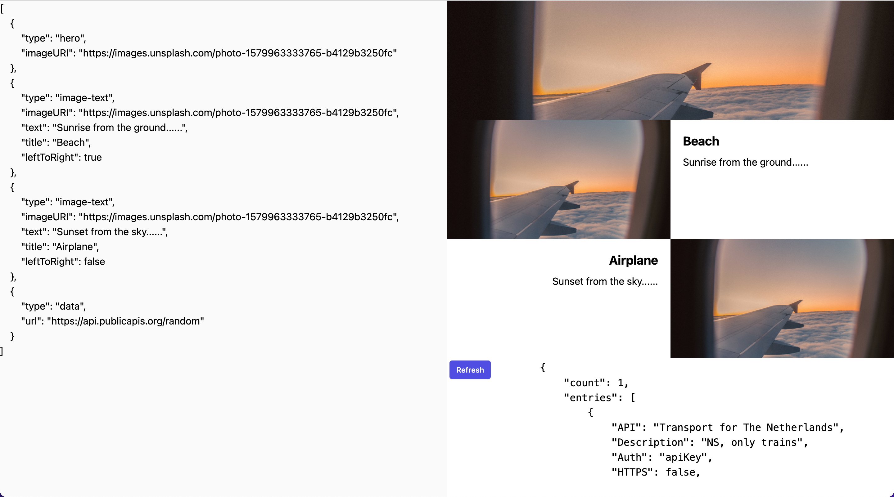

# Twingate App

Hosted [here](https://xari.github.io/twingate-app/), screenshot below.

## Spec

Find the spec document [here](./spec.md).

## Start it up

In the project directory, you can run:

### `npm start`

Runs the app in the development mode.\
Open [http://localhost:3000](http://localhost:3000) to view it in your browser.

The page will reload when you make changes.\
You may also see any lint errors in the console.

### `npm test`

Launches the test runner in the interactive watch mode.\
