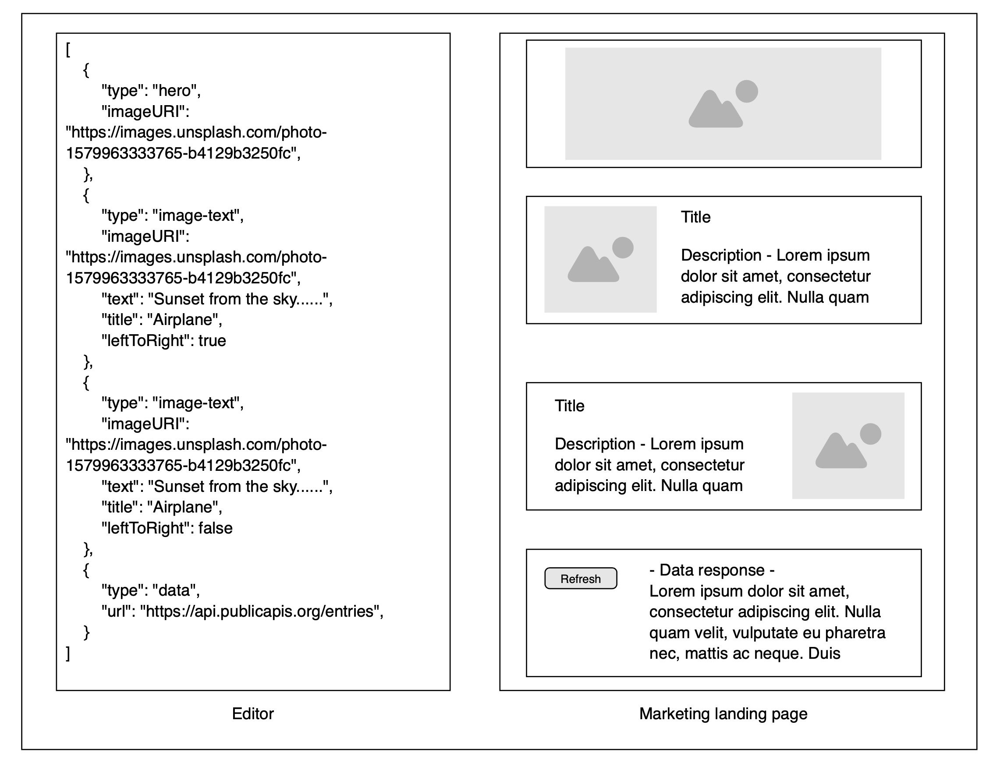

# Technical Spec

# Overview

This demo app implements the mock-up below as a React application.

This application features a JSON input component that can be used to defined a seris of components to be rendered by the application.

There are currently three component types.

- Hero
- ImgText
- Data

Each of these components renders some markup, and either an image or some fetched JSON data.

# Proposed Solution

This is a fairly minimalist application.
I'm using TailwindCSS, and borrowing some rough component models from TailwindUI.

# Implementation Plan

1. Part 1
   1. The initial implementation is a very rudimentary mock-up. I hope to have time to add a couple of basic tests (snapshots, .etc.), but mostly I'm focusing on getting a stable and interactive app up and running -that also looks somewhat presentable.
2. Part 2
   1. Further development of this app could focus on fetching the images via the Unsplash API, rather than simply using the URL from the component specification as the `src` attribute for the image. This would allow for smaller, and properly dimensioned images to be fetched, along with any relevant metadata for the image.
   2. There's a lot that could be done to validate the individual properties of the user-provided JSON objects. Currently, the app only checks that the provided string is valid JSON, but it doesn't do anything to test the structure of the provided JSON (_"Is it an array or an object?"_, for example.)
